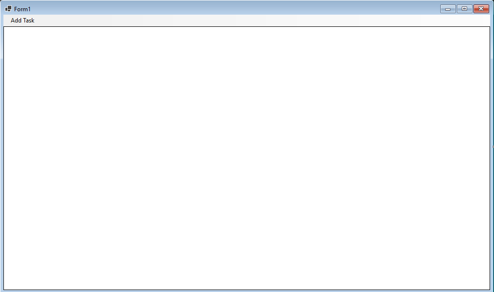
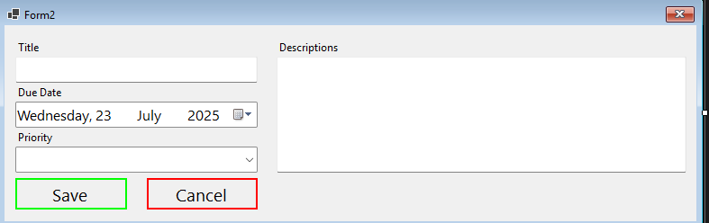

# Task Management Application README

## Overview

This repository contains a Windows Forms application written in C# for managing tasks. The application allows users to add, edit, delete, and mark tasks as completed, with data stored in a JSON file.

## Features

- **Add Task**: Create new tasks with title, description, due date, and priority.
- **Edit Task**: Modify existing task details.
- **Delete Task**: Remove tasks from the list.
- **Mark Completed**: Toggle task completion status.
- **Priority Visualization**: Display priorities with color coding (Red for High, Yellow for Medium, LightGreen for Low).
- **Data Persistence**: Tasks are saved to and loaded from a JSON file.

## Installation

1. Ensure you have the following installed:
   - .NET Framework
   - Newtonsoft.Json (via NuGet)
2. Clone the repository to your local machine.
3. Open the solution file in Visual Studio.
4. Restore the NuGet packages.
5. Build and run the application.

## Usage

### Adding a Task

- Click "Add Task" from the menu to open the task entry form.
- Enter the task title, description, due date, and select a priority.
- Click "Save" to add the task.

### Editing a Task

- Click the "Edit" button in the task grid to modify a task.
- Update the details and click "Save" to confirm changes.

### Deleting a Task

- Click the "Delete" button in the task grid.
- Confirm the deletion in the dialog box to remove the task.

### Marking a Task as Completed

- Check or uncheck the "Completed" checkbox in the task grid to update the status.

## Screenshots

## Code Structure

- **Form1.cs**: Main form handling task list display, editing, deletion, and data persistence using a DataGridView.
- **Form2.cs**: Form for adding or editing tasks with input validation.
- **Task.cs**: Class defining the task model with properties for Id, Title, Description, DueDate, Priority, and IsCompleted.

## Data Storage

- Tasks are stored in a JSON file named `tasks.json` in the application directory.

## Contributing

Contributions are welcome. Please fork the repository and submit pull requests.

## License

This project is licensed under the MIT License.

